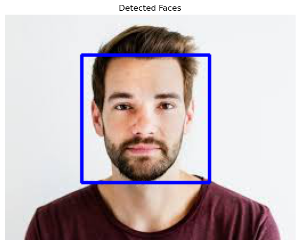
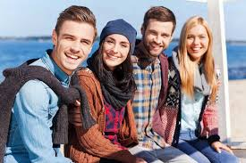
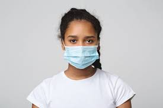
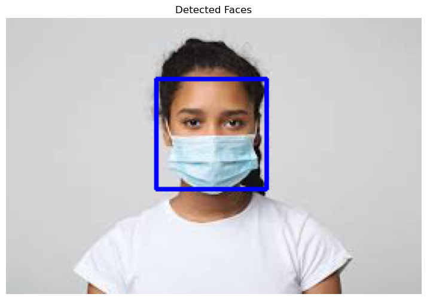

# Face-Detection

# Abusive Language Detection in Social Media

## Abstract
This project implements real-time face detection using Haar Cascades in OpenCV. 

## Introduction
Face detection is a computer technology that enables machines to identify human faces within digital images or videos. It involves locating and isolating the human face from the rest of the image and identifying key facial features, such as the eyes, nose, and mouth.

To detect faces, computer algorithms use a variety of techniques, including machine learning and computer vision. Some algorithms use pattern recognition to identify facial features, while others use statistical analysis or neural networks to analyze the image data.

There are several techniques used in face detection, including traditional methods such as Haar Cascades that we are using, and modern deep learning-based methods such as YOLO, Retina Face, and SSD. These methods have different levels of accuracy and computational complexity and are suitable for different applications.

## Approach
The face detection approach in this project utilizes the Haar Cascade classifier, a pre-trained model available in OpenCV. The key steps in the implementation are:
Loading the pre-trained Haar Cascade classifier for frontal faces.
Reading the input image and converting it to grayscale for processing.
Applying the detectMultiScale function to identify faces in the image.
Drawing rectangles around the detected faces on the original image.
Displaying the result using matplotlib for visualization.
The detectMultiScale function is configured with specific parameters:
scaleFactor: 1.1
minNeighbors: 5
minSize: (30, 30)
flags: cv2.CASCADE_SCALE_IMAGE
These parameters are tuned to balance detection accuracy

## Experiments
I experemnted the machine with three samples images (straight person face, group of people faces, mask person face)

**Examples:**

- **Ex1:**  
   
   
  
- **Ex2:**  
   
   

- **Ex3:**  
   
   

Skills Used
This project demonstrates proficiency in several key areas:
Python Programming: The entire project is implemented in Python, showcasing fundamental programming skills.
OpenCV: Extensive use of OpenCV for image processing tasks, including reading images, color space conversion, and applying the Haar Cascade classifier.
Computer Vision Concepts: Understanding and application of face detection algorithms and image processing techniques.
Data Visualization: Utilization of matplotlib for displaying the processed images with detected faces.
File Handling: Working with file paths to load images and the Haar Cascade classifier XML file.

## 🚀 About This Project
Hi 👋, I'm Ahmad Munir

This project implements real-time face detection using Haar Cascades in OpenCV.

💬 Ask me about CV, Face Detection, and machine learning models

📫 How to reach me: ahnather2@gmail.com

## 🔗 Links

